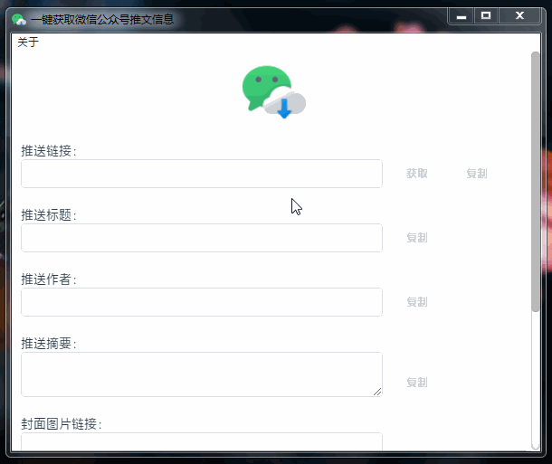

# woa-getter 简介

woa-getter 全称是 wechat official account getter，是一款使用 electron 开发的软件，用于一键获取微信公众号推文信息，使用方法：在推送链接输入框粘贴复制好的推送文章，点击获取即可。

软件截图：

安装依赖：`npm i`

运行项目：`npm run electron:serve`

打包项目：`npm run electron:build`
